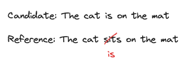

# Metrics Guide

This document provides detailed information about the translation quality metrics implemented in eval-kit.

## Table of Contents

### Metrics to evaluate translation using reference texts

- [BLEU Score](#bleu-score)
- [TER (Translation Edit Rate)](#ter-translation-edit-rate)
- [BERTScore](#bertscore)
- [Comparison & When to Use Each](#comparison--when-to-use-each)

### Metrics to evaluate AI-generated content without reference texts

- [Coherence](#coherence)
- [Perplexity](#perplexity)

---

## BLEU Score

### What is BLEU?

BLEU (Bilingual Evaluation Understudy) is an algorithm for evaluating the quality of machine-translated text. It measures how similar the candidate translation is to one or more reference translations by computing n-gram precision with a brevity penalty.

### How it Works

1. **Tokenization**: Both candidate and reference texts are tokenized into words
2. **N-gram Generation**: Creates n-grams of sizes 1 through 4 (unigrams, bigrams, trigrams, 4-grams)
3. **Modified Precision**: Calculates precision for each n-gram size with clipping to prevent overcounting
4. **Geometric Mean**: Combines precisions using geometric mean (via logarithms for numerical stability)
5. **Brevity Penalty**: Penalizes translations that are too short

**Detailed Example:**

For candidate "The cat is sitting on the mat" vs reference "The cat sits on the mat":

```
Step 1: Tokenization
  Candidate (7 tokens): [the, cat, is, sitting, on, the, mat]
  Reference (6 tokens): [the, cat, sits, on, the, mat]

Step 2: N-gram Precision
  1-gram: 5/7 matches = 71.43% [the(2), cat, on, mat]
  2-gram: 3/6 matches = 50.00% [the cat, on the, the mat]
  3-gram: 1/5 matches = 20.00% [on the mat]
  4-gram: 0/4 matches = 0.00%

Step 3: Brevity Penalty
  Candidate length (7) ≥ Reference length (6) → No penalty = 1.0

Step 4: Geometric Mean (using logarithms)
  Valid precisions: [0.7143, 0.5000, 0.2000] (exclude 0)
  Log sum: log(0.7143) + log(0.5000) + log(0.2000) = -2.6391
  Mean of logs: -2.6391 / 3 = -0.8797
  Geometric mean: exp(-0.8797) = 0.4149

Step 5: Final Score
  BLEU = 1.0 × 0.4149 × 100 = 41.49
```

### Score Range

- **0-100**: Higher is better
- **100**: Perfect match with reference
- **50-100**: Good to excellent quality
- **30-50**: Fair quality
- **0-30**: Poor quality

### Usage Example

```typescript
import { calculateBleu } from 'eval-kit';

const result = calculateBleu(
  "The cat is sitting on the mat",
  "The cat sits on the mat"
);
```

### Configuration Options

```typescript
interface BleuOptions {
  maxNgramSize?: number;  // Default: 4 (use 1-4 grams)
  smoothing?: number;     // Default: 0 (floor value for zero precisions)
}
```

**Smoothing explained:**

Smoothing prevents the BLEU score from becoming zero when some n-gram precisions are zero. BLEU uses geometric mean, which becomes zero if any precision is zero. This commonly happens with longer n-grams (3-grams, 4-grams) in short sentences.

- `smoothing = 0` (default): No smoothing, standard corpus-level BLEU (may return 0 for short texts)
- `smoothing = 0.1`: Sets a floor of 10% for any zero precision, making BLEU work well for sentence-level evaluation

Example: For "The cat" vs "The dog", without smoothing the 2-gram, 3-gram, and 4-gram precisions are all 0%, making the final score 0. With smoothing = 0.1, these become 10%, allowing a meaningful score to be calculated.

### Strengths

- ✅ Fast and efficient (< 1ms per evaluation)
- ✅ Language-agnostic
- ✅ Good correlation with human judgment at corpus level
- ✅ Widely adopted standard in MT research

### Limitations

- ❌ Doesn't consider semantics, only lexical overlap
- ❌ Poor correlation with human judgment for single sentences
- ❌ Doesn't account for synonyms or paraphrases
- ❌ Sensitive to word order

### When to Use

- Comparing different translation systems
- Corpus-level evaluation (100+ sentences)
- When you need fast, repeatable metrics
- Research and benchmarking

### Reference

Papineni, K., Roukos, S., Ward, T., & Zhu, W. J. (2002). "BLEU: a Method for Automatic Evaluation of Machine Translation"

---

## TER (Translation Edit Rate)

### What is TER?

TER measures the number of edits required to transform a candidate translation into the reference translation. It calculates the minimum number of word-level edits (insertions, deletions, substitutions) normalized by reference length.

### How it Works

1. **Tokenization**: Both texts are tokenized into words
2. **Edit Distance**: Calculates Levenshtein distance (minimum edits needed)
3. **Normalization**: Divides by reference length
4. **Inversion**: Converts to 0-100 scale where higher is better

### Score Range

- **0-100**: Higher is better (inverted from raw TER)
- **100**: Perfect match (0 edits needed)
- **80-100**: Excellent quality, minimal post-editing
- **60-80**: Good quality, some post-editing needed
- **40-60**: Fair quality, significant post-editing
- **0-40**: Poor quality, extensive revision needed

### Usage Example



```typescript
import { calculateTer } from 'eval-kit';

const result = calculateTer(
  "The cat is on the mat",
  "The cat sits on the mat"
);

console.log(result.score);      // 83.33
console.log(result.editCount);  // 1
console.log(result.rawTer);     // 0.1667
console.log(result.feedback);   // "Excellent translation with only 1 minor edit(s) needed"
```

### Configuration Options

```typescript
interface TerOptions {
  normalize?: boolean;  // Default: true (normalize by reference length)
}
```

### Strengths

- ✅ Intuitive metric (measures post-editing effort)
- ✅ Fast computation (< 1ms per evaluation)
- ✅ Provides actionable feedback
- ✅ Good for detecting word-level errors
- ✅ Language-agnostic

### Limitations

- ❌ Doesn't account for semantic similarity
- ❌ Single reference may not capture all valid translations
- ❌ Simplified implementation (no phrase shifts)
- ❌ Sensitive to tokenization

### When to Use

- Estimating post-editing effort
- Quality assurance workflows
- When you need human-readable feedback
- Detecting word-level translation errors

### Reference

Snover, M., Dorr, B., Schwartz, R., Micciulla, L., & Makhoul, J. (2006). "A Study of Translation Edit Rate with Targeted Human Annotation"

---

## BERTScore

### What is BERTScore?

BERTScore uses contextual embeddings from BERT models to compute similarity between candidate and reference texts. Unlike BLEU and TER which rely on exact word matches, BERTScore captures semantic similarity using neural language models.

**Important**: BERTScore runs **completely locally** on your machine. The model is downloaded once and cached locally. After the initial download, all inference happens offline on your CPU with no network calls or API costs.

### How it Works

1. **Tokenization**: Both texts are tokenized into individual words
2. **Model Loading**: Loads pre-trained BERT model (cached after first use)
3. **Token Embeddings**: Creates contextualized embeddings for each token
4. **Precision Calculation**: For each candidate token, finds the maximum similarity with any reference token, then averages
5. **Recall Calculation**: For each reference token, finds the maximum similarity with any candidate token, then averages
6. **F1 Score**: Harmonic mean of precision and recall

**Example:**
```
Candidate: "The cat sits on the mat" (6 tokens)
Reference: "The cat" (2 tokens)

Precision (candidate → reference):
  For each candidate token, find best match in reference:
  - "the" → "the" (1.0)
  - "cat" → "cat" (1.0)
  - "sits" → "cat" (0.3)  ← no good match
  - "on" → "the" (0.2)
  - "the" → "the" (1.0)
  - "mat" → "cat" (0.2)
  Average: (1.0 + 1.0 + 0.3 + 0.2 + 1.0 + 0.2) / 6 ≈ 0.62

Recall (reference → candidate):
  For each reference token, find best match in candidate:
  - "the" → "the" (1.0)
  - "cat" → "cat" (1.0)
  Average: (1.0 + 1.0) / 2 = 1.0

F1 = 2 × (0.62 × 1.0) / (0.62 + 1.0) ≈ 0.76
```

This token-level approach correctly shows precision < recall when the candidate is verbose (has extra words).

### Score Range

- **0-100**: Higher is better
- **95-100**: Semantically identical
- **85-95**: Very similar meaning
- **75-85**: Similar meaning, some differences
- **60-75**: Partially similar
- **0-60**: Different meanings

### Usage Example

```typescript
import { calculateBertScore } from 'eval-kit';

const result = await calculateBertScore(
  "The cat sits on the mat",
  "A feline is on the rug"
);

console.log(result.f1);         // 87.23
console.log(result.precision);  // 87.23
console.log(result.recall);     // 87.23
console.log(result.modelUsed);  // "sentence-transformers/all-MiniLM-L6-v2"
```

### Configuration Options

```typescript
interface BertScoreOptions {
  model?: string;  // Default: "sentence-transformers/all-MiniLM-L6-v2"
  scoreType?: "f1" | "precision" | "recall";  // Default: "f1"
}

// Available models:
// - "sentence-transformers/all-MiniLM-L6-v2" (recommended, fast)
// - "distilbert-base-uncased" (good quality)
// - "bert-base-uncased" (slower, higher quality)
```

### Strengths

- ✅ Captures semantic similarity beyond exact matches
- ✅ Recognizes paraphrases and synonyms
- ✅ Better correlation with human judgment than n-gram metrics
- ✅ Handles different word orders with similar meaning
- ✅ Context-aware (understands word meanings in context)

### Limitations

- ❌ Requires model download (~400MB for default model)
- ❌ Slower than lexical metrics (100-500ms per evaluation)
- ❌ Depends on quality of underlying BERT model
- ❌ May not work well for languages not in training data
- ❌ Higher memory usage (~500MB RAM)

### When to Use

- Evaluating paraphrases and creative translations
- When semantic similarity matters more than exact words
- Quality-focused evaluation over speed
- Comparing semantically similar but lexically different texts

### Performance Notes

**First call only:**
- Downloads ONNX model from Hugging Face (~90MB for default model)
- Caches to local disk: `~/.cache/huggingface/transformers/`
- Takes 2-5 seconds depending on internet speed
- One-time download per model

**Every subsequent call:**
- Loads from local cache (no network required)
- Runs entirely on your CPU using ONNX Runtime
- 100-500ms per evaluation
- Completely offline - no API calls

**Resource usage:**
- Memory: ~500MB RAM
- Disk space: ~90MB per model (cached locally)
- Network: Only for initial download

### Reference

Zhang, T., Kishore, V., Wu, F., Weinberger, K. Q., & Artzi, Y. (2020). "BERTScore: Evaluating Text Generation with BERT"

---

## Comparison & When to Use Each

### Quick Comparison

| Metric | Speed | Semantic | Synonyms | Paraphrases | Dependencies |
|--------|-------|----------|----------|-------------|--------------|
| **BLEU** | ⚡⚡⚡ Fast | ❌ No | ❌ No | ❌ No | None |
| **TER** | ⚡⚡⚡ Fast | ❌ No | ❌ No | ❌ No | Minimal |
| **BERT** | ⚡ Moderate | ✅ Yes | ✅ Yes | ✅ Yes | BERT model |

### Use Case Recommendations

#### Use BLEU when:
- You need fast, repeatable metrics
- Evaluating at corpus level (100+ sentences)
- Comparing translation systems
- Exact word overlap matters
- Minimal dependencies required

#### Use TER when:
- Estimating post-editing effort
- Need human-readable feedback
- Detecting specific edit types
- Quality assurance workflows
- Want intuitive metric for stakeholders

#### Use BERTScore when:
- Semantic similarity is important
- Evaluating creative or paraphrased translations
- Synonyms and different word orders are acceptable
- Quality is more important than speed
- Have resources for model download

### Best Practice: Use Multiple Metrics

For comprehensive evaluation, use all three metrics together:

```typescript
import { calculateBleu, calculateTer, calculateBertScore } from 'eval-kit';

async function comprehensiveEvaluation(candidate: string, reference: string) {
  const bleu = calculateBleu(candidate, reference);
  const ter = calculateTer(candidate, reference);
  const bert = await calculateBertScore(candidate, reference);

  return {
    bleu: bleu.score,
    ter: ter.score,
    bertScore: bert.f1,
    // Weighted average (customize weights as needed)
    overall: (bleu.score * 0.3 + ter.score * 0.3 + bert.f1 * 0.4)
  };
}
```

### Interpreting Combined Scores

| BLEU | TER | BERT | Interpretation |
|------|-----|------|----------------|
| High | High | High | Excellent translation - lexically and semantically similar |
| Low | Low | High | Creative paraphrase - different words, same meaning |
| High | High | Low | Word overlap but semantic drift |
| Low | Low | Low | Poor translation - needs revision |

---

## Coherence

### What is Coherence?

Coherence measures how well sentences in a text connect and flow together logically. A coherent text has smooth transitions between ideas, maintains topic continuity, and creates a unified narrative or argument. Unlike translation metrics that require reference texts, coherence evaluates text quality independently.

**Key aspects:**
- **Semantic relatedness**: Do consecutive sentences discuss related topics?
- **Logical flow**: Do ideas progress naturally from one sentence to the next?
- **Topic continuity**: Does the text maintain focus on its subject matter?

### How it Works

Coherence is measured using **TF-IDF (Term Frequency-Inverse Document Frequency)** vectors and **cosine similarity**:

1. **Split text into sentences**
2. **Tokenize each sentence** into words
3. **Calculate TF-IDF vectors** for each sentence:
   - **TF (Term Frequency)**: How often a word appears in a sentence
   - **IDF (Inverse Document Frequency)**: How unique a word is across all sentences
   - TF-IDF weights words by importance (common words get lower weights)
4. **Calculate cosine similarity** between consecutive sentence pairs
5. **Average all similarities** to get overall coherence score (0-100)

**Example:**
```
Text: "The cat sat on the mat. The feline appeared comfortable."

Sentence 1 TF-IDF: {cat: 0.69, sat: 0.69, mat: 0.69, the: 0}
Sentence 2 TF-IDF: {feline: 0.69, appeared: 0.69, comfortable: 0.69, the: 0}

Cosine similarity: ~0.15 (low - no shared content words)
Coherence score: 15
```

Higher average similarity = better coherence = sentences share more related vocabulary.

### Score Range

- **0-100**: Higher is better
- **90-100**: Excellent - very strong semantic connections and smooth flow
- **75-89**: Good - strong connections with mostly smooth transitions
- **60-74**: Fair - moderate coherence with some noticeable gaps
- **40-59**: Poor - weak connections and frequent topic shifts
- **0-39**: Very poor - disconnected sentences with no clear topic continuity

### Usage Example

```typescript
import { calculateCoherence } from 'eval-kit';

const text = `
  The cat sat on the mat.
  The feline appeared comfortable on the soft surface.
  It purred contentedly while resting there.
`;

const result = calculateCoherence(text);

console.log(result.score);                    // 45.67
console.log(result.sentenceCount);            // 3
console.log(result.pairwiseSimilarities);     // [0.42, 0.51]
console.log(result.averageSimilarity);        // 0.4567
console.log(result.feedback);                 // "Poor coherence with weak connections..."
```

### Configuration Options

```typescript
interface CoherenceOptions {
  minSentences?: number;  // Default: 2 (min sentences to evaluate)
}
```

### Examples

#### Example 1: High Coherence (Score: ~75)

```typescript
const text = `
  The cat sat on the mat.
  The feline appeared comfortable on the soft surface.
  It purred contentedly while resting there.
`;

const result = calculateCoherence(text);
// Sentences share vocabulary: cat/feline, mat/surface/resting
// Strong topical continuity about a cat resting
```

#### Example 2: Low Coherence (Score: ~5)

```typescript
const text = `
  The cat sat on the mat.
  Quantum physics explains atomic behavior.
  Pizza is a popular Italian food.
`;

const result = calculateCoherence(text);
// No shared vocabulary or topic continuity
// Abrupt topic changes between sentences
```

#### Example 3: Medium Coherence (Score: ~55)

```typescript
const text = `
  The weather was sunny today.
  Many people went to the beach.
  Swimming in the ocean is refreshing.
`;

const result = calculateCoherence(text);
// Moderate topic relationship: weather → beach → swimming
// Some semantic connection but not as tight
```

### Strengths

- ✅ Fast computation (< 10ms for typical text)
- ✅ No external dependencies or ML models needed
- ✅ Language-agnostic (works for any language)
- ✅ Interpretable results (can see which sentence pairs are weak)
- ✅ Works without reference texts

### Limitations

- ❌ Only measures lexical overlap, not deep semantic meaning
- ❌ May give high scores to keyword-stuffed text
- ❌ Doesn't understand pronoun references or discourse markers
- ❌ Can miss coherence from world knowledge or logical reasoning
- ❌ Short texts with few sentences may be misleading

**Example of limitation:**
```typescript
// High coherence score but semantically incoherent:
const text = `
  The cat sat on the mat with the cat.
  The mat had a cat and the cat liked the mat.
`;
// Score: ~95 (lots of shared words: cat, mat)
// But semantically repetitive and unnatural
```

### When to Use

**Good use cases:**
- Evaluating AI-generated stories, articles, or essays
- Assessing text summarization quality
- Checking if content flows naturally
- Detecting topic drift in long-form content
- Quality assurance for generated content

**Not suitable for:**
- Very short texts (1-2 sentences)
- Lists or bullet points (not meant to be coherent)
- Poetry or creative writing with intentional disjunction
- Technical documentation with section breaks

### Reference

This implementation uses the TF-IDF lexical coherence approach, a standard method in computational linguistics for measuring text cohesion through vocabulary overlap.

---

## Perplexity

### What is Perplexity?

Perplexity measures how "surprising" or "unexpected" text is to a language model. It quantifies how well a language model predicts a sequence of words. **Lower perplexity = more natural, predictable text**. Higher perplexity indicates unusual, awkward, or nonsensical word sequences.

Perplexity is particularly useful for evaluating AI-generated content, as it can detect unnatural language patterns that may not be caught by other metrics.

**Mathematical definition:**
```
Perplexity(W) = exp(-1/N × Σ log P(wᵢ | w₁...wᵢ₋₁))
```

Where:
- `W` = sequence of words
- `N` = number of words
- `P(wᵢ | w₁...wᵢ₋₁)` = probability of word `wᵢ` given previous words

### How it Works

This implementation uses a **neural language model (GPT-2)** approach:

1. **Load pre-trained language model** (DistilGPT-2 by default, cached after first use)
2. **Tokenize input text** into tokens
3. **Calculate token probabilities**: For each token, get the probability the model assigns to it given the previous context
4. **Compute perplexity**:
   - Average the log probabilities across all tokens
   - Take the exponential to get perplexity
5. **Normalize to 0-100 scale**: Convert perplexity to a quality score where higher = better

**Important**: Like BERTScore, Perplexity runs **completely locally** on your machine. The model is downloaded once (~150MB for DistilGPT-2) and cached. All inference happens offline on your CPU with no network calls or API costs.

**Example:**
```
Text: "The cat sat on the mat"

Token-by-token probabilities:
  "The" → P = 0.15 (common sentence start)
  "cat" | "The" → P = 0.08 (reasonable after "The")
  "sat" | "The cat" → P = 0.12 (common verb for cat)
  "on" | "The cat sat" → P = 0.18 (natural preposition)
  "the" | "The cat sat on" → P = 0.25 (expected article)
  "mat" | "The cat sat on the" → P = 0.06 (makes sense)

Average log probability: -2.8
Perplexity: exp(2.8) ≈ 16.4
Score: 92 (excellent - natural text)
```

### Score Range

The metric returns both raw perplexity and a normalized score (0-100):

**Raw Perplexity:**
- **< 20**: Excellent - very natural, human-like text
- **20-50**: Good - mostly natural with minor awkwardness
- **50-100**: Fair - somewhat unnatural or unusual phrasing
- **100-300**: Poor - many awkward or unlikely sequences
- **> 300**: Very poor - nonsensical or extremely unnatural

**Normalized Score (0-100):**
- **90-100**: Excellent quality (perplexity < 20)
- **70-90**: Good quality (perplexity 20-50)
- **40-70**: Fair quality (perplexity 50-100)
- **10-40**: Poor quality (perplexity 100-300)
- **0-10**: Very poor quality (perplexity > 300)

### Usage Example

```typescript
import { calculatePerplexity } from 'eval-kit';

const text = "The cat sat on the mat and looked very comfortable.";

const result = await calculatePerplexity(text);

console.log(result.perplexity);        // 15.3
console.log(result.score);             // 94.2
console.log(result.tokenCount);        // 12
console.log(result.averageLogProb);    // -2.73
console.log(result.modelUsed);         // "distilgpt2"
console.log(result.feedback);          // "Excellent text quality..."
```

### Configuration Options

```typescript
interface PerplexityOptions {
  model?: string;    // Default: "distilgpt2"
  stride?: number;   // Default: 512 (sliding window stride)
}

// Available models:
// - "distilgpt2" (recommended, fast, ~150MB)
// - "gpt2" (larger, more accurate, ~500MB)
// - "gpt2-medium" (even larger, ~1.5GB)
```

### Examples

#### Example 1: Low Perplexity (Score: ~94)

```typescript
const text = `
  The cat sat on the mat and looked very comfortable.
  It was a sunny afternoon and the feline was clearly content.
  Soon it began to purr softly while resting.
`;

const result = await calculatePerplexity(text);
// Perplexity: ~15.3
// Score: 94.2
// Natural, fluent text with common word sequences
```

#### Example 2: High Perplexity (Score: ~8)

```typescript
const text = `
  Colorless green ideas sleep furiously.
  The bicycle swims through yesterday's mathematics.
`;

const result = await calculatePerplexity(text);
// Perplexity: ~287.5
// Score: 8.1
// Grammatically correct but semantically nonsensical
// Language model assigns low probability to these sequences
```

#### Example 3: Very High Perplexity (Score: ~1)

```typescript
const text = "xkcd zymurgy quixotic fnord blatherskite gobbledygook";

const result = await calculatePerplexity(text);
// Perplexity: ~1523.7
// Score: 0.9
// Random uncommon words with no coherent meaning
// Extremely low probabilities for these sequences
```

### Strengths

- ✅ Detects unnatural language patterns
- ✅ Based on statistical language modeling
- ✅ Works without reference texts
- ✅ Sensitive to fluency and grammaticality
- ✅ Can identify AI-generated text anomalies
- ✅ Context-aware (considers word sequences, not just individual words)

### Limitations

- ❌ Requires model download (~150MB for DistilGPT-2)
- ❌ Slower than lexical metrics (100-500ms per evaluation)
- ❌ Depends on quality of language model
- ❌ May penalize creative or domain-specific language
- ❌ Higher memory usage (~800MB RAM)
- ❌ Does NOT measure factual correctness or semantic coherence
- ❌ Model trained primarily on English text

**Important caveat:**
```typescript
// Low perplexity doesn't guarantee good content:
const text = "The the the the the the the.";
// Perplexity: might be relatively low (common word)
// But clearly poor quality text

// Use perplexity WITH other metrics like coherence
```

### When to Use

**Good use cases:**
- Evaluating fluency of AI-generated text
- Detecting machine-generated vs. human text
- Quality assurance for text generation systems
- Identifying awkward or unnatural phrasing
- Comparing different language models or prompts
- Spam/gibberish detection

**Not suitable for:**
- Measuring factual accuracy (perplexity doesn't understand truth)
- Evaluating creative writing (may penalize intentional unusual language)
- Domain-specific jargon (model may not know specialized terms)
- Non-English text (unless using appropriate model)
- Translation quality (use BLEU/TER/BERTScore instead)

### Performance Notes

**First call only:**
- Downloads ONNX model from Hugging Face (~150MB for DistilGPT-2)
- Caches to local disk: `~/.cache/huggingface/transformers/`
- Takes 3-8 seconds depending on internet speed
- One-time download per model

**Every subsequent call:**
- Loads from local cache (no network required)
- Runs entirely on your CPU using ONNX Runtime
- 100-500ms per evaluation (depends on text length)
- Completely offline - no API calls

**Resource usage:**
- Memory: ~800MB RAM for DistilGPT-2
- Disk space: ~150MB per model (cached locally)
- Network: Only for initial download
- CPU: Uses all available cores

### Comparison with Other Metrics

| Metric | Measures | Requires Reference | Speed | Use Case |
|--------|----------|-------------------|-------|----------|
| **BLEU** | Lexical overlap | ✅ Yes | ⚡⚡⚡ Fast | Translation quality |
| **TER** | Edit distance | ✅ Yes | ⚡⚡⚡ Fast | Post-editing effort |
| **BERTScore** | Semantic similarity | ✅ Yes | ⚡ Moderate | Paraphrase quality |
| **Coherence** | Topic continuity | ❌ No | ⚡⚡⚡ Fast | Text flow |
| **Perplexity** | Language fluency | ❌ No | ⚡ Moderate | Natural language |

### Best Practice: Combine Metrics

For comprehensive AI text evaluation, use perplexity WITH coherence:

```typescript
import { calculatePerplexity, calculateCoherence } from 'eval-kit';

async function evaluateAIText(text: string) {
  const [perplexity, coherence] = await Promise.all([
    calculatePerplexity(text),
    Promise.resolve(calculateCoherence(text))
  ]);

  return {
    fluency: perplexity.score,        // How natural is the language?
    coherence: coherence.score,       // How well do sentences connect?
    perplexity: perplexity.perplexity,
    overall: (perplexity.score * 0.5 + coherence.score * 0.5)
  };
}
```

### Interpreting Combined Scores

| Perplexity | Coherence | Interpretation |
|------------|-----------|----------------|
| High | High | Excellent - fluent language with logical flow |
| Low | High | Unnatural phrasing but logical progression |
| High | Low | Fluent sentences but poor topic continuity |
| Low | Low | Poor quality - both fluency and flow issues |

### Reference

This implementation is based on the standard perplexity calculation used in natural language processing research. Perplexity was introduced as a metric for evaluating language models in the 1970s and remains a fundamental measure in NLP today.
